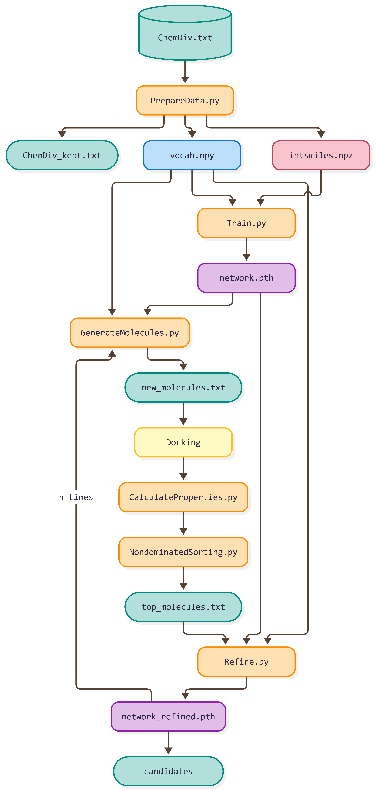

# GenMOO
## Introduction

**GenMOO** is a multi-objective optimization pipeline for *de novo* molecule generation using a stacked-LSTM model trained on **SELFIES** instead of SMILES. 

Through the LSTM generator, we have generated novel molecules and evaluated them via three scores: Docking score (target selectivity), SAscore (synthetic accessibility), and QED~w~ (drug-likeness). 

Based on these three scores, we next performed a non-dominated sorting, picking out top Pareto fronts and utilizing these excellent molecules to fine-tune the model.

After several turns of Pareto optimization, the model will tend to generate molecules with lower docking score, lower SAscore and higher QED~w~ score, and hopefully to expand the Pareto front.

[Self-referencing embedded strings](https://github.com/the-matter-lab/selfies) (SELFIES) is a 100% robust molecular string representation. Any sequence of SELFIES symbols can be decoded to a chemically valid molecule, which nearly eliminates invalid outputs. 

The [synthetic accessibility score](https://link.springer.com/article/10.1186/1758-2946-1-8) (SAscore) is a heuristic metric that quantifies the ease of synthesizing a molecule, calculated as a linear combination of fragment contributions and a complexity penalty.

The [quantitative estimate of drug-likeness](https://www.nature.com/articles/nchem.1243) (QED) is a measure to evaluate drug-likeness for a molecule, which reflects the underlying distribution of molecular properties.

[pymoo](https://pymoo.org/) offers state of the art single- and multi-objective optimization algorithms and many more features related to multi-objective optimization.

## Requirements
### System requirements

**GenMOO** has been implemented using **Python 3** and is based on the **PyTorch** package. It has been tested on Linux (Ubuntu 20.04.6 LTS), and should also work on Windows as well as Mac OSX.

The pipeline needs an GPU and **CUDA** to run at reasonable speed (in particular for training and molecule generating). The present code has been tested on NVIDIA GeForce RTX 4090. For running on other GPUs, some parameter values (e.g. batch size) may need to be changed to adapt to available memory.

For docking, we have run the [GVSrun](https://github.com/Wang-Lin-boop/CADD-Scripts) script to utilize **Schrödinger** software on a GPU cluster.

In this project, we use **R 4.5.3** (Reassured Reassurer) with `ggplot2 (4.0.2)` to plot figures. Any R version ≥ 4.1.0 should be fine.

```r
install.packages("ggplot2")
```

### Package dependencies
GenMOO depends on following packages. The package versions for which we have tested are also provided:
```yml
dependencies:
  - python=3.10
  - pytorch=2.4.1
  - torchvision=0.19.1
  - torchaudio=2.4.1
  - pytorch-cuda=12.4
  - tqdm=4.70.0
  - pymoo=0.6.2
  - rdkit=2026.03.6
  - selfies=2.2.0
  - scikit-learn=1.7.2
  - pandas=2.3.3
  - numpy=2.2.6
```

## Main pipeline



| Script | Role |
|--------|------|
| `step1_PrepareData.py` | Clean + deduplicate SMILES, encode to SELFIES, build the symbol vocabulary (`vocab.npy`) and integer sequences (`intsmiles.npz`) |
| `step2_Train.py` | Train the stacked-LSTM model from scratch |
| `step3_GenerateMolecules.py` | Sample SELFIES symbols, decode to SMILES, write `new_molecules.txt` |
| `step4_CalculateProperties.py` | ... |
| `step5_NondominatedSorting.py` | ... |
| `step5_Refine.py` | Fine-tune on the selected molecules, then loop back to step3 |


## Quick start

```bash
git clone https://github.com/arche-ens/GenMOO.git GenMOO
cd GenMOO
conda env create -f environment.yml
conda activate genmoo
```

```bash
python step1_PrepareData.py
```

## Model Structure

- 3 stacked LSTM layers (`hidden_size=1024`, `dropout=0.2`) + a linear head.
- **Token-level** SELFIES modelling (one-hot input over the symbol vocabulary).
- Forget-gate bias initialized to `1`; cross-entropy with padded-position masking; Adam (`lr=0.001`) + gradient clipping (`3.0`).
- Generation: temperature softmax + multinomial sampling, with `<pad>` and `<start>` symbols masked out (`-inf`) so they are never emitted.

### Configuration (`config.py`)

- `START_TOKEN = "<start>"`, `END_TOKEN = "<end>"`, `PAD_TOKEN = "<pad>"`.
- `SEQ_LEN = 100` (SELFIES symbols, incl. start/end).
- `NUM_MOLECULES = 20`, `TEMPERATURE = 1.0`, etc. — editable as needed.


## Notes

- This README file is going to be refined.
