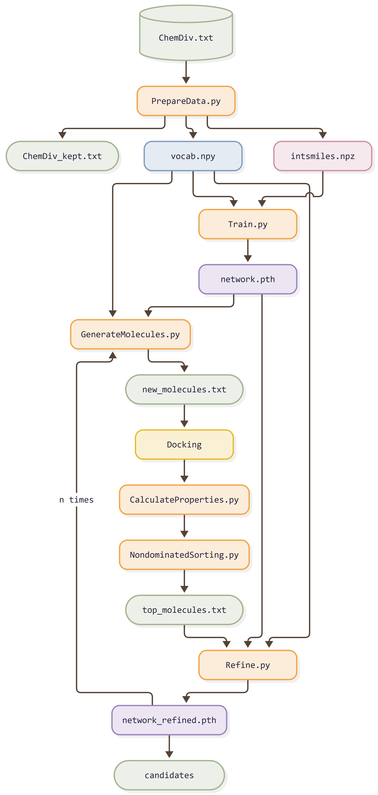

# GenMOO :partying_face::tada: 

## Introduction

**GenMOO** is a multi-objective optimization pipeline for *de novo* molecule generation using a stacked-LSTM model trained on **SELFIES** instead of SMILES. Through the LSTM generator, we have generated novel molecules and evaluated them via three scores: **Docking score** (target selectivity), **SAscore** (synthetic accessibility), and **QED~w~** (drug-likeness). Based on these three scores, we next performed a **non-dominated sorting**, picking out top Pareto fronts and utilizing these excellent molecules to fine-tune the model. After several turns of Pareto optimization, the model will tend to generate molecules with lower docking score, lower SAscore and higher QED~w~ score, and hopefully to expand the Pareto front.


[Self-referencing embedded strings](https://github.com/the-matter-lab/selfies) (SELFIES) is a 100% robust molecular string representation. Any sequence of SELFIES symbols can be decoded to a chemically valid molecule, which nearly eliminates invalid outputs. 

The [synthetic accessibility score](https://link.springer.com/article/10.1186/1758-2946-1-8) (SAscore) is a heuristic metric that quantifies the ease of synthesizing a molecule, calculated as a linear combination of fragment contributions and a complexity penalty.

The [quantitative estimate of drug-likeness](https://www.nature.com/articles/nchem.1243) (QED) is a measure to evaluate drug-likeness for a molecule, which reflects the underlying distribution of molecular properties.

[pymoo](https://pymoo.org/) offers state of the art single- and multi-objective optimization algorithms and many more features related to multi-objective optimization.

## Requirements
### System requirements

**GenMOO** has been implemented using **Python 3** and is based on the **PyTorch** package. It has been tested on Linux (Ubuntu 20.04.6 LTS), and should also work on Windows as well as Mac OSX.

The pipeline needs an GPU and **CUDA** to run at reasonable speed (in particular for training and molecule generating). The present code has been tested on NVIDIA GeForce RTX 4090. For running on other GPUs, some parameter values (e.g. batch size) may need to be changed to adapt to available memory.

For docking, we have run the [GVSrun](https://github.com/Wang-Lin-boop/CADD-Scripts) script to utilize **Schrödinger** software on a GPU cluster.

In this project, we use **R 4.5.3** (Reassured Reassurer) with `ggplot2 (4.0.2)` to plot figures. Any R version ≥ 4.1.0 should be fine. You can easily install `ggplot2` in R console with the following command:

```r
install.packages("ggplot2")
```

### Package dependencies
GenMOO depends on following packages. The package versions for which we have tested are also provided:
```yml
dependencies:
  - python=3.10
  - pytorch=2.4.1
  - torchvision=0.19.1
  - torchaudio=2.4.1
  - pytorch-cuda=12.4
  - tqdm=4.70.0
  - pymoo=0.6.2
  - rdkit=2026.03.6
  - selfies=2.2.0
  - scikit-learn=1.7.2
  - pandas=2.3.3
  - numpy=2.2.6
```

## Quick start

```bash
git clone https://github.com/arche-ens/GenMOO.git GenMOO
cd GenMOO
conda env create -f environment.yml
conda activate genmoo
```

```bash
python step1_PrepareData.py
```

> [!caution]
> This chapter is under refinement. :construction_worker:

## Main pipeline



| Script | Role |
|--------|------|
| `step1_PrepareData.py` | Clean and deduplicate original library, encode SMILES trings to SELFIES, build the symbol vocabulary and integer sequences |
| `step2_Train.py` | Train the stacked-LSTM model from scratch |
| `step3_GenerateMolecules.py` | Samples new molecules from the trained LSTM model |
| `step4_CalculateProperties.py` | Calculate required properties of molecules, including SAscore and QED~w~ (Docking score is externally generated from Schrödinger) |
| `step5_NondominatedSorting.py` | Perfrom non-dominated sorting based on three scores, show Pareto fronts and seletct top molecules |
| `step5_Refine.py` | Fine-tune on the selected molecules, then loop back to step3 |


## Model Structure

GenMOO's generator is a character-level (in fact token-level) recurrent language model. Its job is: Given the sequence of SELFIES symbols produced so far, predict the distribution over the next symbol.

Once trained, sampling from that distribution one symbol at a time yields a full molecule, which can be decoded back into a SMILES string.


$$
\begin{array}{ll} \\
   i_t = \sigma(W_{ii} x_t + b_{ii} + W_{hi} h_{t-1} + b_{hi}) \\
   f_t = \sigma(W_{if} x_t + b_{if} + W_{hf} h_{t-1} + b_{hf}) \\
   g_t = \tanh(W_{ig} x_t + b_{ig} + W_{hg} h_{t-1} + b_{hg}) \\
   o_t = \sigma(W_{io} x_t + b_{io} + W_{ho} h_{t-1} + b_{ho}) \\
   c_t = f_t \odot c_{t-1} + i_t \odot g_t \\
   h_t = o_t \odot \tanh(c_t) \\
\end{array}
$$

### Configuration

| Parameter | Value | Meaning |
|-----------|-------|---------|
| `input_size` / `vocab_size` | 125 | SELFIES symbol vocabulary + 3 special tokens |
| `hidden_size` | 1024 | LSTM hidden units per layer |
| `num_layers` | 3 | stacked LSTM layers |
| `dropout` | 0.2 | dropout between layers |
| `batch_first` | `True` | the input and output tensors are provided as `(batch, seq, feature)` instead of `(seq, batch, feature)` |
| `SEQ_LEN` | 100 | max sequence length (incl. `<start>` & `<end>`) |
| `TEMPERATURE` | 1.0 | . |

## References
> [!caution]
> This chapter is under refinement. :construction_worker: