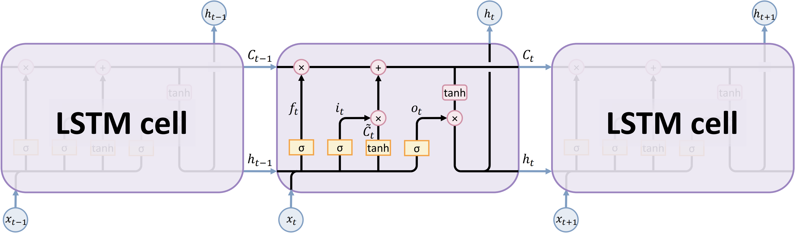
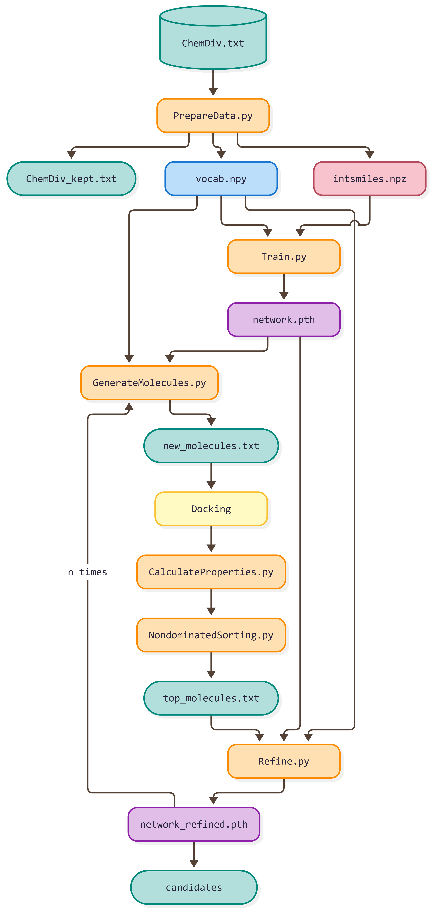

提供中文翻译版，以原文为准。

## 依赖
### 系统要求

**GenMOO** 使用 **Python 3** 实现，基于 **PyTorch** 框架开发。已在 Linux（Ubuntu 20.04.6 LTS）上通过测试，预计也可在 Windows 和 macOS 上运行。

该流程需要 GPU 和 **CUDA** 支持才能以合理的速度运行，尤其是在模型训练和分子生成阶段。当前代码已在 NVIDIA GeForce RTX 4090 上通过测试。如需在其他 GPU 上运行，可能需要根据可用显存调整部分参数（例如批次大小）。

在分子对接阶段，我们使用 [GVSrun](https://github.com/Wang-Lin-boop/CADD-Scripts) 脚本，在计算集群上调用 **Schrödinger Suite**（2024-1，Build 135）。也可以在个人电脑上运行 Schrödinger 任务，但运行时间取决于 CPU 核数。此外，还需要预先对靶蛋白进行分子动力学（MD）模拟。

本项目使用 **R 4.5.3**（Reassured Reassurer）和 `ggplot2 (4.0.2)` 绘制图表。R 4.1.0 及以上版本均应适用。你可以在 R 控制台中运行以下命令以轻松安装 `ggplot2`：

```r
install.packages("ggplot2")
```

### 包依赖

GenMOO 依赖于以下 python 包。我们还提供了测试过的包版本：
```yml
dependencies:
  - python=3.10
  - pytorch=2.4.1
  - torchvision=0.19.1
  - torchaudio=2.4.1
  - pytorch-cuda=12.4
  - tqdm=4.70.0
  - pymoo=0.6.2
  - rdkit=2026.03.6
  - selfies=2.2.0
  - scikit-learn=1.7.2
  - pandas=2.3.3
  - numpy=2.2.6
```

## 主运行入口

```bash
conda update -n base -c defaults conda
conda env create -f environment.yml
conda activate genmoo
gunzip data/ChemDiv.txt.gz
```

进入根目录后，运行以下命令以训练：
```
bash main.sh
```
或直接运行以下命令获取最终候选分子：
```
bash predict.sh
```

## 数据集

训练初始模型使用的 ChemDiv 数据集由供货商提供，没有使用限制条件。您可以访问 [`data/ChemDiv.txt`](data/ChemDiv.txt) 来获取它。

## 模型

### 模型结构

LSTM 网络是一种循环神经网络，由连续的细胞组成，每个细胞都有三个称为“门”的神经网络层。遗忘门、更新门和输出门决定在附加单元状态中保留哪些信息。单元状态通过整个网络。这样，LSTM 的隐藏状态充当短期记忆，而细胞状态充当长期记忆。我们将 SMILES 分子数据集转化为 SELFIES 表示，使用 one-hot 编码训练了一个 LSTM 网络，以生成新的有效分子。





### 关键参数

| 参数 | 值 | 意义 |
|-----------|-------|---------|
| `vocab_size` | 125 | SELFIES 符号词表（包括 3 个特殊符号） |
| `hidden_size` | 1024 | 每一层的 LSTM 隐藏单元 |
| `num_layers` | 3 | 堆叠 LSTM 网络的层数 |
| `dropout` | 0.2 | 不同 LSTM 层之间的信息丢失率 |
| `SEQ_LEN` | 100 | 最大的符号序列长度（包括特殊符号） |
| `TEMPERATURE` | 0.7 | 遗忘门的初始化参数，推动模型在学习新信息的同时记住旧的知识 |

### 训练与验证日志

您可以访问 [`log.md`](log.md) 获取所有训练与生成日志。

### 随机种子设置

生成新分子时，`torch` 在所有设备上生成随机数的种子设置为 `23333`，即
```python
torch.manual_seed(23333)
```

### 输入输出

输入：用 SMILES 表示的 txt 文件，MD 后 glide_grid 构建的 zip 文件
输出：包含模型权重的 pth 文件，包含最终候选分子的 csv 文件，和小分子-靶点复合物结构预测的 maegz 文件。
